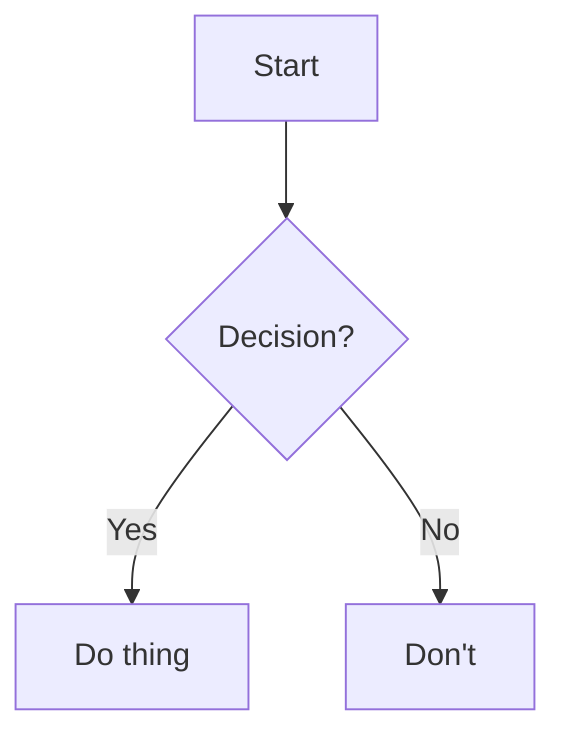

# EAS Projects 
Automation Update/BuildTT Replacement 
Transfer Student Experience 
CIE

Click to expand

- Nested item 1
- Nested item 2
  - Sub-item

Welcome to the Flowershow Template! This is a ready-to-use template for creating beautiful websites from your markdown content, particularly optimized for Obsidian vaults. Test test test 

## Automation update/ BuildTT Replacement

Guiding Principles My approach is to stick as closely to the logic that is being employed in our current process. One thing you might notice me saying is trying to translate what you're doing into simple conditional logic. 

### First Year Timetabling Robot

### Conflict Checker 

## CIE

You can use this template in two main ways:

### CIE under Centralization

If you have an existing Obsidian vault:
1. Install Obsidian Flowershow plugin
2. Adjust the configuration
3. Publish you vault

Your Obsidian links, callouts, and other features will be preserved and rendered beautifully on the web.

### CIE in the Post-pre-mapping era 

Endorsements but also 

## Transfer Student Experience

---

